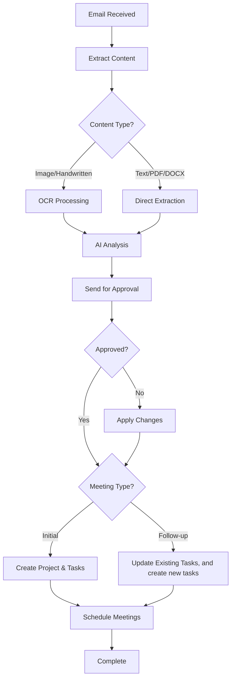

# Project Management Intelligence (PMI) Workflow

An automated n8n workflow that transforms email attachments containing meeting minutes into structured project management tasks in Jira, with intelligent follow-up capabilities and calendar integration.

## 🚀 Overview

This workflow automates the entire project management lifecycle from meeting minutes to task tracking:

1. **Email Monitoring**: Watches for emails with attachments containing meeting minutes
2. **Document Processing**: Extracts text from various file formats (PDF, DOCX, images, Google Docs, **and handwritten reports**)
3. **AI Analysis**: Uses OpenAI to parse meeting content and extract actionable items
4. **Human Validation**: Sends confirmation emails for review and approval
5. **Project Management**: Creates or updates Jira projects and tasks automatically
6. **Calendar Integration**: Schedules follow-up meetings in Google Calendar

## 🏗️ Architecture

### Workflow Components

#### 1. Document Ingestion Layer
- **Gmail Trigger**: Monitors emails with attachments every minute
- **File Type Detection**: Identifies PDF, DOCX, images, and Google Docs
- **Multi-format Processing**: 
  - PDF extraction using n8n's built-in extractor
  - DOCX conversion using DOCX to Text converter
  - **Advanced OCR processing for images via GOT_OCR service (supports handwritten text recognition)**
  - Google Docs processing

#### 2. AI Processing Layer
- **Primary AI Agent**: Extracts structured data from meeting content
- **Follow-up AI Agent**: Handles task updates and status management
- **Validation AI Agent**: Reviews supervisor feedback and applies corrections

#### 3. Integration Layer
- **Jira Integration**: Creates projects, manages tasks, updates statuses
- **Google Calendar**: Schedules meetings automatically
- **Gmail**: Sends confirmation and validation emails

## 📋 Features

### Document Processing
- ✅ PDF text extraction
- ✅ DOCX document processing
- ✅ **Advanced Image OCR (Optical Character Recognition) - supports handwritten text**
- ✅ **Handwritten meeting minutes recognition**
- ✅ Google Docs support
- ✅ Multi-attachment handling

### AI-Powered Analysis
- ✅ Meeting content parsing
- ✅ Action item extraction
- ✅ Project categorization (initial vs. follow-up)
- ✅ Task status management
- ✅ Due date extraction
- ✅ Assignee identification
- ✅ **Handwritten text interpretation and structuring**

### Project Management
- ✅ Automatic Jira project creation
- ✅ Task creation with descriptions and assignments
- ✅ Status updates (TO DO, IN PROGRESS, DONE)
- ✅ Duplicate task prevention
- ✅ Team member mapping

### Workflow Intelligence
- ✅ Initial vs. intermediary meeting detection
- ✅ Human validation loop
- ✅ Error handling and fallbacks
- ✅ Supervisor approval system

## 🛠️ Prerequisites

### Required Services
1. **n8n Instance** (self-hosted or cloud)
2. **Gmail Account** with OAuth2 access
3. **OpenAI API Key** (GPT-4 recommended)
4. **Jira Cloud Instance** with API access
5. **Google Calendar API** access
6. **GOT_OCR Service** (running on `http://192.168.1.24:5000`) - **Enhanced with handwriting recognition capabilities**

### Required n8n Nodes
- Gmail Trigger
- HTTP Request
- Extract from File
- DOCX to Text converter
- AI Agent (LangChain)
- OpenAI Chat Model
- Jira Software
- Google Calendar
- Switch, Merge, Code nodes

## ⚙️ Configuration

### 1. Credentials Setup

#### Gmail OAuth2
- Configure Gmail OAuth2 credentials in n8n
- Enable IMAP access for email monitoring

#### OpenAI API
- Add OpenAI API key to n8n credentials
- Ensure sufficient API quota for GPT-4 usage

#### Jira Software Cloud
- Configure Jira Cloud API credentials
- Ensure proper project permissions

#### Google Calendar
- Set up Google Calendar API access
- Configure OAuth2 for calendar integration

### 2. Environment Variables

#### Jira Configuration
- **Base URL**: Your Jira Cloud instance URL
- **Project Lead ID**: Configure appropriate project lead
- **Default Issue Type**: Task (ensure this is properly selected)

#### Team Member Mapping
```javascript
const teamMap = [
  {
    aliases: ["member1", "alias1", "nickname1"],
    jiraId: "jira_user_id_1"
  },
  {
    aliases: ["member2", "alias2"],
    jiraId: "jira_user_id_2"
  },
  {
    aliases: ["member3", "alias3"],
    jiraId: "jira_user_id_3"
  }
];
```

#### Status ID Mapping
Configure these status IDs based on your Jira workflow:
- **TO DO**: (Your TO DO status ID)
- **IN PROGRESS**: (Your IN PROGRESS status ID)
- **DONE**: (Your DONE status ID)

### 3. OCR Service Setup

Ensure GOT_OCR service is running with handwriting recognition enabled:
```bash
# Example deployment with handwriting support
docker run -d -p 5000:5000 \
  -e ENABLE_HANDWRITING=true \
  -e OCR_MODEL=advanced \
  got-ocr-service
```

**OCR Service Features:**
- Standard printed text recognition
- **Handwritten text recognition**
- Multi-language support
- High accuracy text extraction
- Noise reduction and image preprocessing

**Note**: Replace the service URL with your actual OCR service endpoint.

## 📧 Usage

### Email Format
Send emails with meeting minutes attached to the monitored Gmail account. Supported formats:
- PDF documents
- DOCX files
- **Image files (PNG, JPG, etc.) - including photos of handwritten notes**
- **Scanned handwritten meeting minutes**
- **Phone photos of whiteboard notes**
- Google Docs links

### Handwritten Content Guidelines
For optimal OCR accuracy with handwritten content:
- **Clear, legible handwriting**
- **Good lighting and contrast**
- **Minimal background noise**
- **Straight alignment (avoid skewed photos)**
- **High resolution images (minimum 300 DPI recommended)**

### Expected Meeting Content Structure
The AI expects meeting minutes to contain:
- Project name
- Meeting date
- Action items with:
  - Task descriptions
  - Assigned team members
  - Due dates
  - Current status
- Optional: Next meeting scheduling information

### Sample Meeting Minutes
```
Project: AI Automation for Backlog Creation
Date: May 15, 2025
Status: Initial Meeting

Action Items:
1. Write meeting summaries - Assigned to TeamMember1 - Due: May 25, 2025
2. Select OCR model - Assigned to TeamMember2 - Due: May 20, 2025
3. Integration testing - Assigned to TeamMember3 - Due: May 30, 2025

Next Meeting: May 22, 2025 at 2:00 PM - Sprint Review
```

**Note**: This format works equally well for typed documents, handwritten notes, or mixed content.

## 🔄 Workflow Logic

### Decision Flow


### AI Prompt Templates

#### Meeting Analysis Prompt
```
Read the following meeting text (which may have been extracted from handwritten notes via OCR) and extract:
{
  "project_name": "",
  "status": "initial/intermediary",
  "actions": [
    {
      "description": "",
      "status": "TO DO/IN PROGRESS/DONE",
      "assigned_to": "",
      "due_date": "",
      "notes": ""
    }
  ],
  "meeting_date": "",
  "general_notes": "",
  "ocr_confidence": "high/medium/low"
}
```

## 📊 Data Flow

### Input Processing
1. **Email Attachment** → **Content Type Detection**
2. **Handwritten/Image Content** → **OCR Processing** → **Text Extraction**
3. **Raw Text** → **AI Parsing**
4. **Structured Data** → **Validation**
5. **Approved Data** → **System Integration**

### Output Generation
1. **Jira Projects/Tasks**
2. **Calendar Events**
3. **Status Updates**
4. **Confirmation Emails**

## 🐛 Troubleshooting

### Common Issues

#### OCR Service Connection
```
Error: Cannot connect to GOT_OCR service
Solution: Verify service is running on your configured endpoint
```

#### **Handwriting Recognition Issues**
```
Error: Low OCR confidence or garbled text extraction
Solutions:
- Improve image quality (better lighting, higher resolution)
- Ensure handwriting is clear and legible
- Check image orientation and alignment
- Verify OCR service has handwriting models loaded
```

#### **Image Processing Failures**
```
Error: Cannot process handwritten image
Solutions:
- Check image format compatibility (JPG, PNG, TIFF)
- Verify image file size limits
- Ensure sufficient contrast between text and background
- Try preprocessing image for better clarity
```

#### **Jira Issue Creation Problems**
```
Error: Issue creation failed or invalid issue type
Solution: Re-select the issue type as "Task" in the Jira node configuration and run again
```

#### Jira Authentication
```
Error: 401 Unauthorized
Solution: Check Jira API credentials and permissions
```

#### Gmail Quota Exceeded
```
Error: Gmail API quota exceeded
Solution: Reduce polling frequency or upgrade quota
```

### Debug Mode
Enable debug logging in n8n settings to trace workflow execution, including OCR processing steps.

## 🔒 Security Considerations

- Store all API keys as n8n credentials
- Use OAuth2 for Gmail integration
- Implement proper Jira permissions
- **Sanitize OCR-extracted content before processing**
- **Consider privacy implications of handwritten content processing**
- Regular credential rotation

## 📈 Performance Optimization

### Recommended Settings
- **Polling Interval**: Every minute (adjustable based on volume)
- **Batch Processing**: 5 items per batch for Jira operations
- **Timeout Settings**: 45 seconds for OCR operations, 30 seconds for AI operations
- **Retry Logic**: 3 attempts with exponential backoff
- **OCR Quality**: Balance between speed and accuracy based on handwriting clarity

### **OCR Performance Tips**
- **Image Preprocessing**: Automatic contrast adjustment and noise reduction
- **Resolution Optimization**: Automatic scaling for optimal OCR performance
- **Batch Processing**: Handle multiple handwritten pages efficiently
- **Caching**: Store OCR results to avoid reprocessing identical images

## 🚀 Deployment

### Import Instructions
1. Copy the workflow JSON
2. Import into n8n instance
3. Configure all credentials
4. **Set up OCR service with handwriting recognition**
5. Test with sample data (including handwritten samples)
6. Activate workflow

### Health Monitoring
Monitor these metrics:
- Email processing success rate
- **OCR extraction accuracy for handwritten content**
- AI extraction accuracy
- Jira API response times
- Calendar event creation success
- **Handwriting recognition confidence scores**

## 📚 API Documentation

### Key Endpoints Used
- **Jira**: `/rest/api/3/project`, `/rest/api/3/issue`
- **Gmail**: OAuth2 + IMAP triggers
- **Google Calendar**: Calendar API v3
- **OpenAI**: Chat Completions API
- **GOT_OCR**: `/ocr/process` (with handwriting support)

### **OCR API Specifications**
```javascript
// OCR Request for handwritten content
{
  "image": "base64_encoded_image",
  "mode": "handwriting",
  "language": "en",
  "preprocessing": true,
  "confidence_threshold": 0.7
}

// OCR Response
{
  "text": "extracted_text",
  "confidence": 0.89,
  "processing_time": 3.2,
  "detected_handwriting": true
}
```

## 🤝 Contributing

1. Fork the repository
2. Create feature branch
3. Test changes thoroughly (including handwritten samples)
4. Submit pull request with documentation

## 📄 License

This workflow is provided as-is for educational and business use.

## 🆘 Support

For issues and questions:
1. Check troubleshooting section
2. Review n8n community docs
3. Verify all service configurations
4. **For OCR issues, check handwriting clarity and image quality**
5. Contact workflow maintainer

---

**Version**: 1.1  
**Last Updated**: June 2025  
**Compatibility**: n8n v1.0+  
**New Features**: Enhanced OCR with handwriting recognition support
