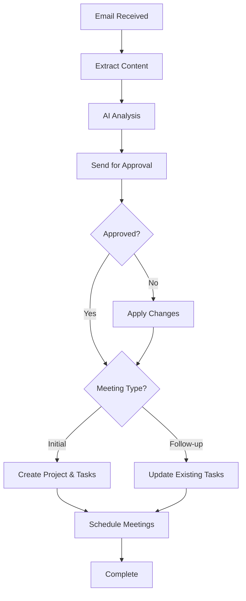

# Project Management Intelligence (PMI) Workflow

An automated n8n workflow that transforms email attachments containing meeting minutes into structured project management tasks in Jira, with intelligent follow-up capabilities and calendar integration.

## 🚀 Overview

This workflow automates the entire project management lifecycle from meeting minutes to task tracking:

1. **Email Monitoring**: Watches for emails with attachments containing meeting minutes
2. **Document Processing**: Extracts text from various file formats (PDF, DOCX, images, Google Docs)
3. **AI Analysis**: Uses OpenAI to parse meeting content and extract actionable items
4. **Human Validation**: Sends confirmation emails for review and approval
5. **Project Management**: Creates or updates Jira projects and tasks automatically
6. **Calendar Integration**: Schedules follow-up meetings in Google Calendar

## 🏗️ Architecture

### Workflow Components

#### 1. Document Ingestion Layer
- **Gmail Trigger**: Monitors emails with attachments every minute
- **File Type Detection**: Identifies PDF, DOCX, images, and Google Docs
- **Multi-format Processing**: 
  - PDF extraction using n8n's built-in extractor
  - DOCX conversion using DOCX to Text converter
  - OCR processing for images via GOT_OCR service
  - Google Docs processing

#### 2. AI Processing Layer
- **Primary AI Agent**: Extracts structured data from meeting content
- **Follow-up AI Agent**: Handles task updates and status management
- **Validation AI Agent**: Reviews supervisor feedback and applies corrections

#### 3. Integration Layer
- **Jira Integration**: Creates projects, manages tasks, updates statuses
- **Google Calendar**: Schedules meetings automatically
- **Gmail**: Sends confirmation and validation emails

## 📋 Features

### Document Processing
- ✅ PDF text extraction
- ✅ DOCX document processing
- ✅ Image OCR (Optical Character Recognition)
- ✅ Google Docs support
- ✅ Multi-attachment handling

### AI-Powered Analysis
- ✅ Meeting content parsing
- ✅ Action item extraction
- ✅ Project categorization (initial vs. follow-up)
- ✅ Task status management
- ✅ Due date extraction
- ✅ Assignee identification

### Project Management
- ✅ Automatic Jira project creation
- ✅ Task creation with descriptions and assignments
- ✅ Status updates (TO DO, IN PROGRESS, DONE)
- ✅ Duplicate task prevention
- ✅ Team member mapping

### Workflow Intelligence
- ✅ Initial vs. intermediary meeting detection
- ✅ Human validation loop
- ✅ Error handling and fallbacks
- ✅ Supervisor approval system

## 🛠️ Prerequisites

### Required Services
1. **n8n Instance** (self-hosted or cloud)
2. **Gmail Account** with OAuth2 access
3. **OpenAI API Key** (GPT-4 recommended)
4. **Jira Cloud Instance** with API access
5. **Google Calendar API** access
6. **GOT_OCR Service** (running on `http://192.168.1.24:5000`)

### Required n8n Nodes
- Gmail Trigger
- HTTP Request
- Extract from File
- DOCX to Text converter
- AI Agent (LangChain)
- OpenAI Chat Model
- Jira Software
- Google Calendar
- Switch, Merge, Code nodes

## ⚙️ Configuration

### 1. Credentials Setup

#### Gmail OAuth2
```json
{
  "id": "XHVTWlMqhoM5pQnc",
  "name": "Gmail account 6"
}
```

#### OpenAI API
```json
{
  "id": "dYZWfaOXMEhGY7FU",
  "name": "OpenAi account"
}
```

#### Jira Software Cloud
```json
{
  "id": "YdvFt7v4vz7qIXDq",
  "name": "Jira SW Cloud account"
}
```

#### Google Calendar
```json
{
  "id": "DwXml0uWIwNkJPW8",
  "name": "Google Calendar account"
}
```

### 2. Environment Variables

#### Jira Configuration
- **Base URL**: `https://rosiemt29.atlassian.net`
- **Project Lead ID**: `712020:5c0f38f5-a7d2-444d-ba9f-b8c9bcbfc4c1`
- **Default Issue Type**: Task (ID: 10113)

#### Team Member Mapping
```javascript
const teamMap = [
  {
    aliases: ["maram", "mara", "manom", "trabelsi"],
    jiraId: "712020:2252e3e41471-49e6-8bd2-00914e2036eb"
  },
  {
    aliases: ["iheb", "ihebih99"],
    jiraId: "712020:90c222f1-6437-463b-ae70-9f3fc75d6cb6"
  },
  {
    aliases: ["sonia", "gharsalli"],
    jiraId: "615717bc9cdb9300724883d3"
  }
];
```

#### Status ID Mapping
- **TO DO**: 11
- **IN PROGRESS**: 21
- **DONE**: 31

### 3. OCR Service Setup

Ensure GOT_OCR service is running:
```bash
# Example deployment
docker run -d -p 5000:5000 got-ocr-service
```

## 📧 Usage

### Email Format
Send emails with meeting minutes attached to the monitored Gmail account. Supported formats:
- PDF documents
- DOCX files
- Image files (PNG, JPG, etc.)
- Google Docs links

### Expected Meeting Content Structure
The AI expects meeting minutes to contain:
- Project name
- Meeting date
- Action items with:
  - Task descriptions
  - Assigned team members
  - Due dates
  - Current status
- Optional: Next meeting scheduling information

### Sample Meeting Minutes
```
Project: AI Automation for Backlog Creation
Date: May 15, 2025
Status: Initial Meeting

Action Items:
1. Write meeting summaries - Assigned to Sonia - Due: May 25, 2025
2. Select OCR model - Assigned to Maram - Due: May 20, 2025
3. Integration testing - Assigned to Iheb - Due: May 30, 2025

Next Meeting: May 22, 2025 at 2:00 PM - Sprint Review
```

## 🔄 Workflow Logic

### Decision Flow


### AI Prompt Templates

#### Meeting Analysis Prompt
```
Read the following meeting text and extract:
{
  "project_name": "",
  "status": "initial/intermediary",
  "actions": [
    {
      "description": "",
      "status": "TO DO/IN PROGRESS/DONE",
      "assigned_to": "",
      "due_date": "",
      "notes": ""
    }
  ],
  "meeting_date": "",
  "general_notes": ""
}
```

## 📊 Data Flow

### Input Processing
1. **Email Attachment** → **Content Extraction**
2. **Raw Text** → **AI Parsing**
3. **Structured Data** → **Validation**
4. **Approved Data** → **System Integration**

### Output Generation
1. **Jira Projects/Tasks**
2. **Calendar Events**
3. **Status Updates**
4. **Confirmation Emails**

## 🐛 Troubleshooting

### Common Issues

#### OCR Service Connection
```
Error: Cannot connect to GOT_OCR service
Solution: Verify service is running on http://192.168.1.24:5000
```

#### Jira Authentication
```
Error: 401 Unauthorized
Solution: Check Jira API credentials and permissions
```

#### Gmail Quota Exceeded
```
Error: Gmail API quota exceeded
Solution: Reduce polling frequency or upgrade quota
```

### Debug Mode
Enable debug logging in n8n settings to trace workflow execution.

## 🔒 Security Considerations

- Store all API keys as n8n credentials
- Use OAuth2 for Gmail integration
- Implement proper Jira permissions
- Sanitize extracted content before processing
- Regular credential rotation

## 📈 Performance Optimization

### Recommended Settings
- **Polling Interval**: Every minute (adjustable based on volume)
- **Batch Processing**: 5 items per batch for Jira operations
- **Timeout Settings**: 30 seconds for AI operations
- **Retry Logic**: 3 attempts with exponential backoff

## 🚀 Deployment

### Import Instructions
1. Copy the workflow JSON
2. Import into n8n instance
3. Configure all credentials
4. Test with sample data
5. Activate workflow

### Health Monitoring
Monitor these metrics:
- Email processing success rate
- AI extraction accuracy
- Jira API response times
- Calendar event creation success

## 📚 API Documentation

### Key Endpoints Used
- **Jira**: `/rest/api/3/project`, `/rest/api/3/issue`
- **Gmail**: OAuth2 + IMAP triggers
- **Google Calendar**: Calendar API v3
- **OpenAI**: Chat Completions API

## 🤝 Contributing

1. Fork the repository
2. Create feature branch
3. Test changes thoroughly
4. Submit pull request with documentation

## 📄 License

This workflow is provided as-is for educational and business use.

## 🆘 Support

For issues and questions:
1. Check troubleshooting section
2. Review n8n community docs
3. Verify all service configurations
4. Contact workflow maintainer

---

**Version**: 1.0  
**Last Updated**: June 2025  
**Compatibility**: n8n v1.0+
